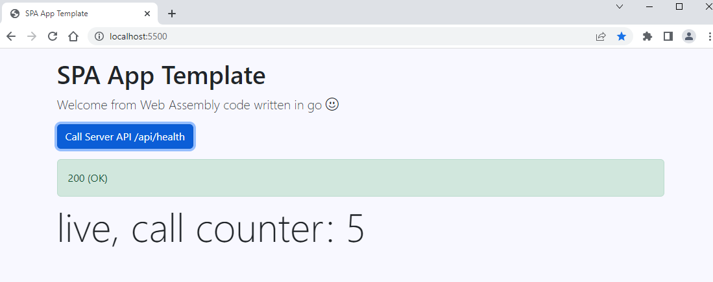

# spaserver 

Single Page Application (SPA) Web Server in GO

Ready to use with web assemply code.


Manage clean shutdown

Fork this repo and use it to start your own SPA in seconds.

The package is available here `github.com/sunraylab/spaserver`

## SPA webpage

Default website is located into the `./webapp` directory, providing:

- A bootstrap index.html
    - embedding Bootstrap 5.2.1 core CSS & icons 
    - scripts required for a wasm app
    - some html for running a basic call to the web server api
- Two js files required for a webassembly. Keep it as is unless you don't need or want wasm.
- the compiled main.wasm file. This file need to be rebuild with your custom code, see here under
- a default spa.css 

Customize `index.html` and `spa.css` as you wish. 

## SPA Web Assembly client code

The `main.wasm` compiled file is loaded by the browser via `myapp.js` which is referenced in the `index.html` page.

The source code of main.wasm is located in `./wasm/main.go`, so written in GO.

This is the core front of your SPA and where you may do most of customization.

Chen ready you need to compil it into the 'main.wasm' file with the following command inside the `./wasm/` directory:

```bash
GOOS=js GOARCH=wasm go build -o ../webapp/main.wasm
```

In case you work under VSCode, you can run the `buid wasm` task provided in the `.vscode` directory.

The default wasm program provides an example and some helpers to:
- modify the DOM: GetElementById, SetInnerHTML, ShowAlert, change ClassName...
- set event handlers: SetOnClick...
- call an API on your server, with an helper to handle errors 

## SPA server

The SPA Web server code is available in the `main.go` at the root.

The server itself should be good enought for most of project, you only neef to add route handlers for your APIs.

The server get the `SPA_ENV` environment variable to know which configuration file to load. By default the `dev` configuration will be loaded.

So the server loads a configuration file to be able to start. This file is located in the `./configs/` directory, or if not found, in `/etc/spa/`. 

Configurations are managed with the `configs` sub package, and can be customized if required.

Configurations are described in a file formated according to `toml` syntax.

The default `dev` config file `config.dev.toml` look like this:

```toml
# dev environement configration

# SPA main direcory
spafiledir = "./webapp" # the dir where are located the files to serve

# HTTP configuration
http_port = ":5500"        # the spa server port
http_rwTimeout = 15        # Read and Write http timeout, in second
http_idleTimeout = 20      # Idle http timeout, in second
http_cache-control = false # Http Cache Controle, usually false to disable cache in dev environment
```

The server serves all pages which are into the `spafiledir` and handles `/api/` routes. `.wasm` files are served with a specific header `content-type= application/wasm` to follow recommendations and best practices.

Finally you can pass the `--verbose` flag when you launch the server to make it more talkative.

The server accepts graceful shutdowns when quit via SIGINT (Ctrl+C) and SIGTERM. All connexions are properly closed, and current active tasks get extra time to terminate properly too.

## Disclaimer

This project is based on the gowebapi project for Web Assembly bindings in Go.

As mentionned in their website:

> WARNING: The current API is in very early state and should be consider to be expremental

## References

- [gowebapi project](https://github.com/gowebapi/webapi) providing Go Language Web Assembly bindings in alpha version.

## Licence

[MIT Licence](LICENSE)

gowebapi [BSD 3-Clause License](https://github.com/gowebapi/webapi/blob/master/LICENSE)
